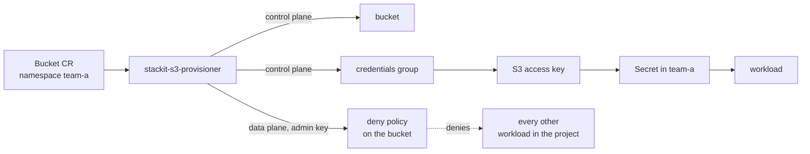

# stackit-s3-provisioner

[](https://github.com/guided-traffic/stackit-s3-provisioner/actions)
[](https://github.com/guided-traffic/stackit-s3-provisioner)
[](https://goreportcard.com/report/github.com/guided-traffic/stackit-s3-provisioner)
[](LICENSE)

A Kubernetes operator that turns one `Bucket` custom resource into one isolated workload on
**STACKIT Object Storage**: a bucket, its own credentials group, an S3 access key, an explicit
deny-based bucket policy that keeps every other workload in the project out, and a Secret in the
`Bucket`'s namespace carrying the credentials *and* the connection parameters an application needs.
One operator deployment serves one STACKIT project in one region, bound by a service-account key
([ADR 0005](docs/adr/0005-the-operator-serves-one-project-in-one-region.md)). It never writes a
`Bucket`'s spec or labels, so a Git repository stays the single source of truth
([ADR 0010](docs/adr/0010-the-operator-never-writes-to-a-bucket-spec.md)).



## <a id="features"></a>✨ Key features

- 🪣 **One CR, one isolated workload** — bucket, credentials group, access key, policy and Secret, provisioned idempotently.
- 🔒 **Isolation is fought for, not assumed** — the provider default inside a project is open, so every bucket gets an explicit `Deny` document ([ADR 0003](docs/adr/0003-workloads-are-isolated-by-an-explicit-deny-policy.md)).
- 🔑 **Ready-to-consume Secret** — credentials plus endpoint, region and bucket URL, in env-var-style keys you can hand to `envFrom`.
- 🔁 **Rotation on request only** — an opaque annotation value triggers exactly one rotation, and re-applying it from Git does nothing ([ADR 0007](docs/adr/0007-a-workload-credential-lives-in-its-secret-and-rotates-only-on-request.md)).
- 👀 **Read grants declared by the data owner** — a bucket lists the siblings in its own namespace that may read it ([ADR 0008](docs/adr/0008-a-read-grant-is-declared-by-the-bucket-that-owns-the-data.md)).
- 📦 **One-shot clone** — seed a new bucket once from any S3-compatible endpoint, with live transfer progress on the CR ([ADR 0011](docs/adr/0011-a-clone-runs-once-as-a-job-in-the-operator-namespace.md)).
- 🧹 **Deletion cannot lose data by accident** — a non-empty bucket blocks teardown; wiping needs two switches, one of them cluster-wide ([ADR 0006](docs/adr/0006-a-bucket-is-deleted-only-when-it-is-empty.md)).
- 📏 **Size and a monthly cost estimate on the CR** — measured by a separate controller that can never affect readiness ([ADR 0014](docs/adr/0014-bucket-size-is-measured-by-a-separate-controller.md)).
- 🩺 **A provider blip is not an outage of your fleet** — `Ready` reports the last *verified* state ([ADR 0012](docs/adr/0012-ready-describes-the-last-verified-state.md)) and a fleet-wide breaker stops calling a failing provider at all ([ADR 0013](docs/adr/0013-a-provider-outage-is-held-fleet-wide.md)).
- 🧭 **GitOps-safe by construction** — only `status`, the finalizer and one bookkeeping annotation are ever written.
- 📊 **22 metrics and 11 opt-in alerts**, shipped as a `PrometheusRule` you can switch off rule by rule.
- 🧱 **Skeleton mode** — without a service-account key the operator starts, reconciles and makes no cloud call at all.

## <a id="naming"></a>📛 Naming conventions

Every deterministic name this operator generates. Explanations live in
[docs/operations/bucket-naming.md](docs/operations/bucket-naming.md) and
[docs/operations/credentials.md](docs/operations/credentials.md).

**Credentials Secret data keys** — written into `spec.secretRef.name`, in the `Bucket`'s namespace.

| Default key | Value | Overridden by |
| --- | --- | --- |
| `AWS_ACCESS_KEY_ID` | S3 access key id | `spec.secretRef.keys.accessKeyID` |
| `AWS_SECRET_ACCESS_KEY` | S3 secret access key | `spec.secretRef.keys.secretAccessKey` |
| `S3_BUCKET` | the physical bucket name | `spec.secretRef.keys.bucketName` |
| `S3_REGION` | the region | `spec.secretRef.keys.region` |
| `S3_ENDPOINT` | endpoint host, no scheme | `spec.secretRef.keys.endpoint` |
| `S3_BUCKET_URL` | full path-style bucket URL | `spec.secretRef.keys.bucketURL` |

An empty override falls back to the default. Two fields resolving to the same key is rejected
before anything is written. `S3_ENDPOINT` and `S3_BUCKET_URL` are omitted when the value is empty.

**Names composed in STACKIT**

| Object | Pattern | Notes |
| --- | --- | --- |
| Physical bucket | `<prefix>-<namespace>-<spec.bucketName>`, empty parts dropped | `bucketNaming.prefix` and `bucketNaming.includeNamespace`; frozen at first provisioning ([ADR 0009](docs/adr/0009-the-physical-bucket-name-is-composed-and-then-frozen.md)) |
| Workload credentials group | `s3op-<namespace>-<name>` truncated to 23 characters, plus `-` and an 8-hex FNV-1a-32 of `<namespace>/<name>` | A **display label only**. Which group a bucket owns is recorded in its tags, never looked up by this name ([ADR 0002](docs/adr/0002-a-credentials-group-is-attributed-through-its-bucket.md)) |
| Admin credentials group | `operator-admin` | One per project, shared by every bucket ([ADR 0004](docs/adr/0004-the-operator-bootstraps-its-own-s3-admin-credential.md)) |

**Bucket tags** — S3 bucket tagging; the operator's only proof that a cloud bucket is its own.

| Tag | Value | Purpose |
| --- | --- | --- |
| `managed-by` | `ownership.name` (default `stackit-s3-provisioner`) | Fleet identity; must match before a pre-existing bucket is adopted or deleted |
| `owner` | `<namespace>/<name>` of the `Bucket` CR | Binds the cloud bucket to one CR, survives a CR UID change |
| `credentials-group-id` | the workload credentials-group id | The attribution the policy and the teardown act on |
| `credentials-group-urn` | the workload credentials-group URN | The principal written into the policy |

**Names composed in Kubernetes**

| Object | Pattern | Where it lives |
| --- | --- | --- |
| Admin credential Secret | `stackit-s3-provisioner-admin` (`--admin-credentials-secret-name`) with data keys `accessKeyID`, `secretAccessKey`, `urn`, `credentialsGroupID` | The operator's own namespace (`POD_NAMESPACE`) |
| Clone Job | `s3op-clone-<namespace>-<name>` truncated to 43 characters, plus `-` and the same 8-hex hash | The operator's namespace |
| Clone staging Secret | the clone Job name plus `-src` | The operator's namespace |
| User-facing ClusterRoles | `<fullname>-view` and `<fullname>-edit` — `<fullname>` is the release name when it already contains the chart name (as it does in the fast start below), otherwise `<release>-stackit-s3-provisioner` | Cluster-scoped, aggregation fragments only, never bound on their own ([ADR 0001](docs/adr/0001-a-bucket-only-affects-its-own-namespace.md), [docs/security/rbac-and-privilege.md](docs/security/rbac-and-privilege.md)) |

**Metadata the operator reads or writes on a `Bucket`**

| Key | Kind | Meaning |
| --- | --- | --- |
| `stackit-bucket.gtrfc.com/rotate-credentials-at` | Annotation, written by you | Any value differing from `status.lastRotationTrigger` requests one rotation |
| `stackit-bucket.gtrfc.com/resolved-bucket-name` | Annotation, written by the operator | The frozen physical bucket name, durable against status loss |
| `stackit-bucket.gtrfc.com/finalizer` | Finalizer, written by the operator | Guards teardown; the only other metadata write |

**API identifiers**

| What | Value |
| --- | --- |
| API group and version | `stackit-bucket.gtrfc.com/v1` |
| Kind, plural, short name | `Bucket`, `buckets`, `bkt` |
| Metric name prefix | `stackit_s3_provisioner_` |
| Alert name prefix | `StackitS3` |

## <a id="documentation"></a>📚 Documentation

| Where | What lives there |
| --- | --- |
| [docs/adr/](docs/adr/README.md) | The fourteen decisions: what the operator does, why, what was rejected and what it costs. |
| [docs/operations/](docs/operations/README.md) | Running and integrating: prerequisites, deployment, GitOps, configuration, naming, status, deletion, credentials, cloning, read grants, usage and cost, provider outages, monitoring. |
| [docs/security/](docs/security/README.md) | The security design, one page per perspective — tenancy and isolation, credentials and Secrets, RBAC and privilege, ownership and attribution — each ending with what it does not cover. |
| [docs/developer/](docs/developer/README.md) | How the subsystems work, for somebody about to change them — plus the repository layout, the build and test matrix, CI and release, and the extension checklists. |
| [docs/tickets/](docs/tickets/) | Work still outstanding. |
| [SECURITY.md](SECURITY.md) | How to report a vulnerability. The design is `docs/security/`. |

<details>
<summary><strong>External references</strong> — the sources this documentation was written against</summary>

None of these is maintained by this project and nothing here re-reads them. Where a claim rests on
one of them and was never measured against the provider used here, the page making the claim says
so in the sentence that makes it.

| Source | What it is the source for |
| --- | --- |
| [STACKIT Object Storage — concepts](https://docs.stackit.cloud/products/storage/object-storage/basics/concepts/) | The provider's own model: project, service, bucket, credentials group, access key. |
| [Bucket policies](https://docs.stackit.cloud/products/storage/object-storage/how-tos/bucket-policies/) | The policy surface every isolation and read-grant document is written against ([ADR 0003](docs/adr/0003-workloads-are-isolated-by-an-explicit-deny-policy.md)). |
| [Create and delete Object Storage credentials](https://docs.stackit.cloud/products/storage/object-storage/how-tos/create-and-delete-object-storage-credentials/) | The credentials-group and access-key lifecycle the operator drives ([ADR 0004](docs/adr/0004-the-operator-bootstraps-its-own-s3-admin-credential.md), [ADR 0007](docs/adr/0007-a-workload-credential-lives-in-its-secret-and-rotates-only-on-request.md)). |
| [Supported operations on buckets and objects](https://docs.stackit.cloud/products/storage/object-storage/reference/supported-operations-on-buckets-and-objects/) | Which S3 operations the backend accepts — the vocabulary the policy action lists are drawn from. |
| [Service accounts](https://docs.stackit.cloud/platform/access-and-identity/service-accounts/) | The identity one operator deployment authenticates as ([ADR 0005](docs/adr/0005-the-operator-serves-one-project-in-one-region.md)). |
| [Authentication flows — the key flow](https://docs.stackit.cloud/platform/access-and-identity/service-accounts/authentication-flows/) | The key flow: the mechanism behind the key file [docs/operations/prerequisites.md](docs/operations/prerequisites.md) asks you to export. |
| [Go SDK — `objectstorage`](https://pkg.go.dev/github.com/stackitcloud/stackit-sdk-go/services/objectstorage) | The control-plane client the operator is built on, and the first of the two sources the resource model in [docs/developer/stackit-api.md](docs/developer/stackit-api.md) was confirmed against. |
| [Terraform provider for STACKIT](https://github.com/stackitcloud/terraform-provider-stackit) | The **second** source that resource model was confirmed against — its schema, read alongside the SDK, because one generated surface alone was not treated as evidence of the model. |
| [NetApp StorageGRID — bucket and group access policies](https://docs.netapp.com/us-en/storagegrid/s3/bucket-and-group-access-policies.html) | The backend's own documentation, and the **only** citation behind the lockout behaviour that makes every bucket policy exempt the operator's admin identity. That the backend can deny even the account root is taken from the vendor and **has never been measured against the provider used here** ([ADR 0004](docs/adr/0004-the-operator-bootstraps-its-own-s3-admin-credential.md), *Residual risks*). |
| [STACKIT price list (PDF)](https://stackit.com/en/asset/download/37788/file/STACKIT_price_list.pdf) | The price per started gigabyte per started hour, and the absence of any request, operation or traffic position. |
| [Object Storage Leistungsschein (PDF, German)](https://stackit.com/de/asset/download/34186/file/Leistungsschein_STACKIT_Object_Storage.pdf) | The service description that names the billing metric itself. |
| [Object Storage product page with prices](https://stackit.com/en/products/storage/stackit-object-storage) | The same prices as published outside the PDFs. |

The last three are the billing basis the monthly cost estimate rests on
([ADR 0014](docs/adr/0014-bucket-size-is-measured-by-a-separate-controller.md)). They were read by
hand on 2026-09-01 and **nothing re-reads them**, so a price change reaches this repository only
when somebody checks — the figures, their document versions and what is not verified about them are
on [docs/operations/usage-and-cost.md](docs/operations/usage-and-cost.md).

</details>

## <a id="fast-start"></a>🚀 Fast start

Before the first install, read [docs/operations/prerequisites.md](docs/operations/prerequisites.md):
the service account needs a role **on the project, never on the organisation** — an inherited
organisation role silently defeats cross-project isolation and no code here can detect it.

```bash
helm repo add stackit-s3-provisioner https://guided-traffic.github.io/stackit-s3-provisioner/
helm repo update

kubectl create namespace stackit-s3-provisioner-system        # example

# The STACKIT service-account key (key flow: an RSA private key embedded in the JSON).
kubectl -n stackit-s3-provisioner-system create secret generic stackit-sa-key \
  --from-file=sa-key.json=./account.json

helm install stackit-s3-provisioner stackit-s3-provisioner/stackit-s3-provisioner \
  --namespace stackit-s3-provisioner-system \
  --set stackit.region=eu01 \
  --set stackit.serviceAccountKey.secretName=stackit-sa-key

kubectl -n stackit-s3-provisioner-system rollout status deploy/stackit-s3-provisioner
```

Leaving `stackit.serviceAccountKey.secretName` empty is **skeleton mode**: `Bucket` resources
reconcile, no cloud call is made, and every `Bucket` reports `Ready=False` with reason
`NotImplemented`.

A minimal `Bucket` — save it as `bucket.yaml`:

```yaml
apiVersion: stackit-bucket.gtrfc.com/v1
kind: Bucket
metadata:
  name: my-bucket
  namespace: team-a
spec:
  bucketName: my-bucket          # example; immutable once created
  secretRef:
    name: my-bucket-s3           # example; the Secret is created in team-a
```

```bash
kubectl create namespace team-a               # example; the namespace the manifest pins
kubectl apply -f bucket.yaml
kubectl wait -n team-a --for=condition=Ready bucket/my-bucket --timeout=180s
```

Verify:

```bash
kubectl -n team-a get bkt
# NAME        BUCKET      PHASE   READY   STATUS                                  REGION   SIZE   COST/MONTH   AGE
# my-bucket   my-bucket   Ready   True    bucket "my-bucket" provisioned with …   eu01                         42s
# (example; the SIZE and COST/MONTH cells stay empty until bucketUsage measurement is switched on)

kubectl -n team-a get secret my-bucket-s3 -o jsonpath='{.data.S3_BUCKET_URL}' | base64 -d
```

Reading the rest of the columns, the conditions and the failure reasons:
[docs/operations/bucket-status.md](docs/operations/bucket-status.md).

<details>
<summary><strong>Upgrade and uninstall</strong></summary>

```bash
helm repo update
helm upgrade stackit-s3-provisioner stackit-s3-provisioner/stackit-s3-provisioner \
  --namespace stackit-s3-provisioner-system \
  --set stackit.region=eu01 \
  --set stackit.serviceAccountKey.secretName=stackit-sa-key
kubectl -n stackit-s3-provisioner-system rollout status deploy/stackit-s3-provisioner
```

Upgrade traps, how a policy change shipped in a new version reaches already-provisioned buckets,
rollback and the CRD contract: [docs/operations/deployment.md](docs/operations/deployment.md).

```bash
helm uninstall stackit-s3-provisioner -n stackit-s3-provisioner-system
```

The CRD carries `helm.sh/resource-policy: keep`. What that means for an uninstall, and how to
remove the CRD deliberately, is on [docs/operations/deployment.md](docs/operations/deployment.md).

</details>

## <a id="reference"></a>⚙️ Reference

**The complete public surface lives here.** What a setting means, what it costs and when to
change it is on the matching page under [docs/operations/](docs/operations/README.md).

<details>
<summary><strong><code>Bucket</code> — <code>spec</code></strong></summary>

| Field | Type | Default | Meaning |
| --- | --- | --- | --- |
| `bucketName` | string, required | — | 3–63 characters, DNS-compliant, **immutable**. The physical name may differ (see `bucketNaming`). |
| `region` | string | `eu01` | Must equal the operator's region, or the `Bucket` parks as `Failed`. |
| `secretRef.name` | string, required | — | Secret receiving the credentials. Always created in the `Bucket`'s namespace, with no spec field able to direct it elsewhere ([ADR 0001](docs/adr/0001-a-bucket-only-affects-its-own-namespace.md) D1/D4). |
| `secretRef.keys.accessKeyID` | string | `AWS_ACCESS_KEY_ID` | Data-key override. |
| `secretRef.keys.secretAccessKey` | string | `AWS_SECRET_ACCESS_KEY` | Data-key override. |
| `secretRef.keys.bucketName` | string | `S3_BUCKET` | Data-key override. |
| `secretRef.keys.region` | string | `S3_REGION` | Data-key override. |
| `secretRef.keys.endpoint` | string | `S3_ENDPOINT` | Data-key override. |
| `secretRef.keys.bucketURL` | string | `S3_BUCKET_URL` | Data-key override. |
| `grantReadAccess[].name` | string, max 32 entries | — | `metadata.name` of another `Bucket` in **this** namespace that may read this bucket; the reference resolves in this namespace only ([ADR 0001](docs/adr/0001-a-bucket-only-affects-its-own-namespace.md) D3). Referencing itself is rejected. |
| `cloneFrom.endpoint` | string, required within the block | — | Source S3 endpoint: bare host (TLS assumed) or a scheme-qualified URL. |
| `cloneFrom.bucket` | string, required within the block | — | Source bucket name at that endpoint. |
| `cloneFrom.region` | string | — | Source region, where SigV4 signing needs one (`eu-central-1` — example). |
| `cloneFrom.addressingStyle` | enum `path` \| `virtual-hosted` | `path` | `virtual-hosted` for AWS-style sources. The destination is always path-style. |
| `cloneFrom.secretRef.name` | string, required within the block | — | Secret holding the source credentials, **in this namespace only**. |
| `cloneFrom.secretRef.keys.accessKeyID` | string | `AWS_ACCESS_KEY_ID` | Data-key override on the source Secret. |
| `cloneFrom.secretRef.keys.secretAccessKey` | string | `AWS_SECRET_ACCESS_KEY` | Data-key override on the source Secret. |
| `cloneFrom.holdSecretUntilCloned` | bool | `true` | Withhold the workload Secret until the copy succeeded. `Ready` waits for the clone either way. |
| `wipeOnDelete` | bool | `false` | Delete all objects, versions and delete markers before removing the bucket. Mutable, and only honoured when `wipeOnDelete.enabled` is on. |
| `usage.enabled` | bool | inherits `bucketUsage.defaultEnabled` | Cannot switch measurement on while `bucketUsage.enabled` is off. |
| `usage.interval` | Go duration string | inherits `bucketUsage.interval` | Clamped up to `bucketUsage.minInterval`. |
| `usage.includeVersions` | bool | inherits `bucketUsage.includeVersions` | Count non-current versions and delete markers. |

</details>

<details>
<summary><strong><code>Bucket</code> — <code>status</code></strong></summary>

Everything below is written by the operator. `spec` and labels never are.

| Field | Type | Meaning |
| --- | --- | --- |
| `phase` | enum | `Pending`, `Provisioning`, `Ready`, `Failed`, `Deleting`. |
| `message` | string | Current step, or a short failure reason. |
| `observedGeneration` | int | Last reconciled `metadata.generation`. |
| `resolvedBucketName` | string | The frozen physical bucket name. |
| `bucketURL` | string | Path-style S3 URL of the bucket. |
| `credentialsGroupID` / `credentialsGroupURN` | string | The workload credentials group; the URN is its policy principal. |
| `accessKeyID` | string | The key id only — the secret half is never in status. |
| `grantedReadTo` | []string | The `grantReadAccess` entries actually reflected in the policy. |
| `clone.phase` | enum | `Running`, `Completed` (terminal), `Failed` (retried). |
| `clone.startedAt` / `clone.completedAt` | time | Clone timestamps. |
| `clone.totalBytes` / `clone.bytesCopied` | int64 | Denominator measured once before the copy; bytes transferred so far. |
| `clone.progress` / `clone.rate` / `clone.eta` / `clone.message` | string | `2.0 GiB / 18.0 GiB (11%)`, `42.0 MiB/s`, `6m30s` — examples; `message` carries a failure reason. |
| `lastRotationTrigger` / `lastRotationTime` | string, time | The annotation value last acted on, and when. |
| `degradedSince` | time | When the hold on `Ready` began. Cleared on the next success. |
| `operatorVersion` | string | Operator version that last reconciled. |
| `usage.bytes` / `usage.objects` | int64 | Current objects and their size. |
| `usage.versionBytes` / `usage.versionObjects` | int64 | Non-current versions and delete markers; zero unless counted. |
| `usage.billableBytes` / `usage.humanReadable` | int64, string | `bytes + versionBytes`, the cost basis; rendered as `18.0 GiB` — example, prefixed `>=` when truncated. |
| `usage.estimatedMonthlyCost` / `usage.estimatedMonthlyCostCents` / `usage.currency` | string, int64, string | An estimate at the configured list price, not an invoice. |
| `usage.lastMeasurementTime` / `usage.measurementDuration` | time, string | When it was measured, and how long the pass took. |
| `usage.truncated` / `usage.message` | bool, string | The object cap was hit, so every size and cost value is a lower bound; `message` carries a failure or a note about the effective config. |
| `conditions` | []Condition | `Ready` (`Provisioned`, `Failed`, `NotImplemented`), `CloneCompleted` (`Cloning`, `Cloned`, `CloneFailed`), `ProviderReachable` (`ProviderUnreachable`; absent when healthy). Provisioning still in flight shows as `phase: Provisioning`, never as a `Ready` reason. |

</details>

<details>
<summary><strong>Helm values</strong> — every key, at its default</summary>

```yaml
crds:
  install: true                          # default; false when CRDs are applied out-of-band
replicaCount: 1                          # default; see deployment.md before raising it
image:
  repository: guidedtraffic/stackit-s3-provisioner   # default
  pullPolicy: IfNotPresent               # default
  tag: ""                                # default; empty uses the chart appVersion
imagePullSecrets: []                     # default
nameOverride: ""                         # default
fullnameOverride: ""                     # default
serviceAccount:
  create: true                           # default
  annotations: {}                        # default
  name: ""                               # default; generated from the fullname template
bucketRoles:
  create: true                           # default; renders <release>-view and <release>-edit
podAnnotations: {}                       # default
podLabels: {}                            # default
resources:
  requests:
    cpu: 10m                             # default
    memory: 64Mi                         # default
  limits:
    cpu: 500m                            # default
    memory: 256Mi                        # default
nodeSelector: {}                         # default
tolerations: []                          # default
affinity: {}                             # default
leaderElection:
  enabled: true                          # default; keep it on
driftResyncInterval: "10m"               # default; Go duration WITH a unit, "0" disables
providerDegradedGrace: "30m"             # default; "0" disables the hold on Ready
providerCircuit:
  threshold: 3                           # default; 0 disables the breaker
  maxCooldown: "5m"                      # default; probe wait starts at 60s and doubles
bucketNaming:
  prefix: ""                             # default; lowercase DNS-1123 label, e.g. my-cluster
  includeNamespace: false                # default
ownership:
  name: stackit-s3-provisioner           # default; part of the bucket ownership key
wipeOnDelete:
  enabled: false                         # default; the cluster-wide gate for spec.wipeOnDelete
clone:
  image:
    repository: rclone/rclone            # default
    tag: "1.75.0"                        # default; Renovate tracks it
  resources:
    requests: {cpu: 100m, memory: 128Mi} # default
    limits:   {cpu: "1", memory: 512Mi}  # default
  networkPolicy:
    enabled: true                        # default; disable only without a NetworkPolicy CNI
bucketUsage:
  enabled: true                          # default; the hard gate for all measurement
  defaultEnabled: false                  # default; per-Bucket opt-in
  interval: "60m"                        # default; Go duration WITH a unit
  minInterval: "60m"                     # default; floor for spec.usage.interval
  maxObjects: 2000000                    # default; 0 removes the cap
  includeVersions: false                 # default
  concurrency: 2                         # default
  pricing:
    perGBHour: "0.00003697772"           # default; STACKIT list price, Premium EU01 - keep the
                                         # quotes, YAML would read it as a float
    currency: "EUR"                      # default; display only, no conversion
monitoring:
  serviceMonitor:
    enabled: false                       # default; needs the monitoring.coreos.com CRDs
    interval: 30s                        # default
    scrapeTimeout: ""                    # default; empty uses the Prometheus default
    labels: {}                           # default; e.g. {release: kube-prometheus-stack}
  prometheusRule:
    enabled: false                       # default; needs the monitoring.coreos.com CRDs
    labels: {}                           # default
    alerts:                              # abbreviated: eleven keys, each enabled by default,
                                         # plus four tuning values - see the alert table below
stackit:
  region: eu01                           # default; every Bucket's spec.region must match
  serviceAccountKey:
    secretName: ""                       # default; empty = skeleton mode
    secretKey: sa-key.json               # default; mounted at /etc/stackit/<secretKey>
```

</details>

<details>
<summary><strong>Helm values</strong> — the eleven alert toggles</summary>

Every key below sits under `monitoring.prometheusRule.alerts` and has `enabled: true` as its
default. The `PrometheusRule` is rendered only when `monitoring.prometheusRule.enabled` is `true`
**and** at least one alert is enabled. What each series counts, and what to do when one fires:
[docs/operations/monitoring.md](docs/operations/monitoring.md).

| Key | Alert | Fires when |
| --- | --- | --- |
| `bucketsWipeOnDelete.enabled` | `StackitS3BucketsWipeOnDelete` | A `Bucket` carries `spec.wipeOnDelete: true`. |
| `bucketFailed.enabled` | `StackitS3BucketFailed` | A `Bucket` sits in phase `Failed`. |
| `bucketStuckProvisioning.enabled` | `StackitS3BucketStuckProvisioning` | A `Bucket` stays `Pending`/`Provisioning` for 30m. |
| `bucketStuckDeleting.enabled` | `StackitS3BucketStuckDeleting` | A finalizer teardown hangs for 30m — usually the non-empty guard. |
| `cloneFailed.enabled` | `StackitS3CloneFailed` | A clone stays `Failed` for 30m. |
| `skeletonMode.enabled` | `StackitS3SkeletonMode` | The operator runs without a service-account key (critical). |
| `wipeRequestedButGateDisabled.enabled` | `StackitS3WipeRequestedButGateDisabled` | A `Bucket` requests a wipe the operator-wide gate forbids. |
| `reconcileErrors.enabled`, `.threshold` (`6` — default), `.sustainedFor` (`"15m"` — default), `.suppressWhileCircuitOpen` (`true` — default) | `StackitS3ReconcileErrors` | Reconcile errors the circuit breaker did **not** absorb exceed the threshold continuously. |
| `bucketProviderDegraded.enabled`, `.holdForSeconds` (`1200` — default) | `StackitS3BucketProviderDegraded` | A `Ready` state has been held through failures for longer than `holdForSeconds`. Must stay below `providerDegradedGrace`. |
| `usageMeasurementFailing.enabled` | `StackitS3UsageMeasurementFailing` | Size measurements keep failing — readiness is unaffected, so nothing else would show it. |
| `usageMeasurementTruncated.enabled` | `StackitS3UsageMeasurementTruncated` | A `Bucket` keeps hitting `bucketUsage.maxObjects`; its size and cost are lower bounds. |

</details>

<details>
<summary><strong>Flags the chart does not render</strong></summary>

Most operator-behaviour values above render as a flag of the same meaning. The chart's packaging
values render Kubernetes objects instead and map to no flag — `crds.install`, `replicaCount`,
`image`, `imagePullSecrets`, `nameOverride`, `fullnameOverride`, `serviceAccount`,
`bucketRoles.create`, `podAnnotations`, `podLabels`, `resources`, `nodeSelector`, `tolerations`,
`affinity`, `clone.networkPolicy.enabled`, everything under `monitoring`, and `clone.resources`,
which is passed as the `CLONE_JOB_RESOURCES` environment variable. Four of the operator's flags
have no chart key at all.

| Flag / environment variable | Default | Meaning |
| --- | --- | --- |
| `--admin-credentials-secret-name` / `ADMIN_CREDENTIALS_SECRET_NAME` | `stackit-s3-provisioner-admin` | Name of the operator-owned Secret holding the S3 admin credential. The chart leaves it unset, so the default applies. |
| `--operator-namespace` / `POD_NAMESPACE` | the pod's namespace, injected by the chart | Where that Secret and every clone Job live. |
| `--metrics-bind-address` | `:8080` | The metrics listener. The chart passes it explicitly, at this value. |
| `--health-probe-bind-address` | `:8081` | The liveness and readiness listener. The chart passes it explicitly, at this value. |

</details>

## <a id="integrations"></a>🔌 Supported integrations

One row per repeating integration, with the suite that proves it still works. Where nothing proves
it, the row says so.

| Integration | Page | What proves it |
| --- | --- | --- |
| The Helm chart install path | [deployment.md](docs/operations/deployment.md) | `make test-helm-render` asserts on the rendered `ClusterRole` objects, and CI Helm-installs the chart into a Kind cluster it builds itself and runs `make test-e2e`; `make e2e-local` is the same path on a developer machine. Both run on every push to `main` and every pull request against it. |
| STACKIT Object Storage itself | all operations pages | `make e2e-stackit` against the live API with a real key and a guaranteed sweep, plus `go test -tags integration ./stackit/`. Manual by construction — the key is not in the repository. |
| GitOps with FluxCD | [gitops.md](docs/operations/gitops.md) | No suite drives a syncing controller. The no-op property is verified rule by rule and pinned by `TestReconcileIsIdempotent`; Flux is the only one exercised in practice. |
| Argo CD and plain `kubectl apply` | [gitops.md](docs/operations/gitops.md) | Nothing here runs Argo CD; the health-check snippet on that page reads only CRD-verified status fields and is marked unverified. |
| kube-prometheus-stack | [monitoring.md](docs/operations/monitoring.md) | No suite renders or asserts the `ServiceMonitor` or `PrometheusRule`; the verification procedure is manual and on that page. |
| rclone-compatible clone sources | [cloning.md](docs/operations/cloning.md) | `go test ./internal/controller/ -run Clone` offline, `TestCloudClone` under `make e2e-stackit`. Only a STACKIT source has been copied from; virtual-hosted is covered offline only. |

## <a id="development"></a>🛠 Development

Decisions live in [docs/adr/](docs/adr/README.md) and are binding — read the record before changing
the behaviour it describes. Layout, the full test matrix, CI and the extension checklists are in
[docs/developer/](docs/developer/README.md).

```bash
make help                      # every target
make build                     # build the manager binary
make test-unit-coverage        # unit tests, offline
make test-integration-coverage # envtest
make lint gosec vuln cyclo     # linters and security scans
make generate-all              # regenerate CRD + DeepCopy and sync the chart
make e2e-local                 # Kind, install via Helm, e2e smoke tests (no cloud call)
make e2e-stackit               # the same against the REAL API; creates and deletes real resources
```

Run `make generate-all` after any change to `api/v1/` and commit the result — CI fails the release
when the checked-in CRD, DeepCopy or chart drift from the types.

## License

Apache-2.0 — see [LICENSE](LICENSE).
